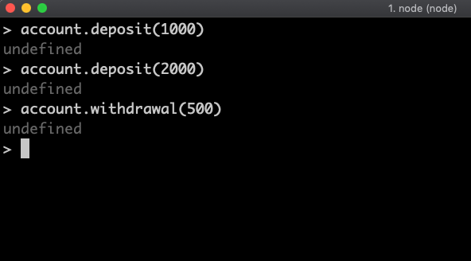
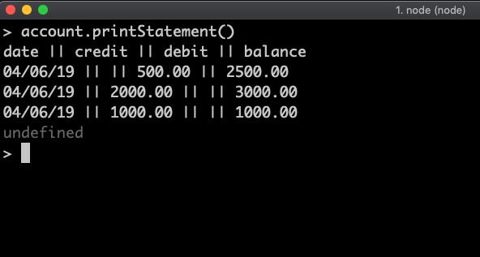

# WELCOME TO JAVA-BANK

This program simulates common transactions associated with a bank account. Once you have required and initialised a new instance of Account, please feel free to deposit and withdrawal how much money you want. At any point in time, you can also print your bank stamement.

Note: this program runs entirely on the terminal.

## User Stories

```
As a bank user,
so that I can add money to my Account
I would like to be able to deposit a sum of my choosing.

As a bank user,
so that I can take money from my Account
I would like to be able to withdrawal a sum of my choosing.

As a bank user,
so that I can keep track of how much money I have
I would like to be able to print a bank statement.

As a bank user,
so that I can keep track of my deposits
I would like my bank statement to show every deposit I made.

As a bank user,
so that I can keep track of my withdrawals
I would like my bank statement to show every withdrawal I made.

As a bank user,
so that I can visualise my deposits, withdrawals, and current balance in any given time,
I would like my bank statement to show the date in which each transaction occurred.

As a bank user,
so that I can visualise my most recent transactions first,
I would like my bank statement to show the date of each transaction in a descending order.
```

## How to use

In order to run this program program properly, make sure you have installed the following node.js packages:

- Date Format (```npm install dateformat```)
- Jasmine (```npm install --save-dev jasmine```)
- Eslint (```npm install --save-dev eslint```)
    and then ```eslint --init```)
- Istanbul (``` npm install --save-dev nyc``` )

Clone this repository.

Open node.js on your terminal (```node```), and type the following:

```
var Account = require('./lib/account.js')
var account = new Account();
```

From this moment on, you can do the following three actions at anytime:
(Don't forget to insert the value as an Integer!!!)

```
account.deposit(value)
account.withdrawal(value)
account.printStatement()
```

## Tech Stack, Tests, and Linter

Developed in Javascript for node.js. Using Jasmine standalone for testing, Eslint for linting, and Istanbul for test coverage.

To run the tests, coverage and the linter, please run ```npm test```.


## Process followed through this challenge
  0. Decided to use Javascript, Jasmine, Eslint and Istanbul.
  1. Read the challenge, took notes of the acceptance criteria
  2. Planned the functions Account and AccountHistory
  3. Wrote user Stories (see below)
  4. Redesigned my functions. They now are Account, Transaction and AccountHistory.
  5. Implemented User Stories with a TDD approach.
  6. Refactored the whole code to check for Single Responsibility principle issues
  7. Final check of the README.

## Why did I structure my code this way?

In this program, I have designed a structure of three classes(i.e. functions). The account function is responsible for three things: deposits, withdrawals, and printing the statement. These are all the functions that the user will need and, in the console, this is the only function that the user will be calling. When you initialise a new Account(), it injects from the AccountHistory function, which handles all the history of transactions related to this account and generates, when requested, an array with all the data related to this history. Every time the user deposits or withdrawals from her account, the Account function calls on my third and final function, the Transaction. This function is responsible for managing the properties of each transaction, namely: the date it happen, what quality it has ("credit" or "debit"), its value, and the account's new balance after this transaction happened. 

## Screenshots

Open node, require and create the account:


Deposit, deposit, withdrawal.



Print your statement.




## Next Steps

- Create an interface with jQuery.
- Set up [Travis CI](https://travis-ci.org) to implement Continuous Integration.
